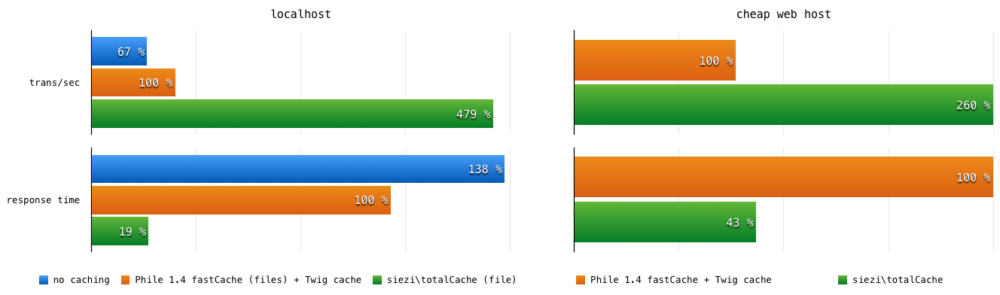

# PhileCMS TotalCache Plugin #

Caches as much as possible (completely avoid parser and template engine).



[Project Home](https://github.com/Schlaefer/phileTotalCache)

### 1.1 Installation (composer) ###

```json
"require": {
   "siezi/phile-total-cache": "*"
}
```

### 1.2 Installation (Manual Download)

* Install [Phile](https://github.com/PhileCMS/Phile)
* copy this plugin into `plugins/siezi/phileTotalCache`

### 2. Activation

After you have installed the plugin you need to activate it. Add the following line to Phile's root `config.php` file:

```php
$config['plugins']['siezi\\phileTotalCache'] = ['active' => true];
```

### 3. Configuration ###

See plugin `config.php` file.